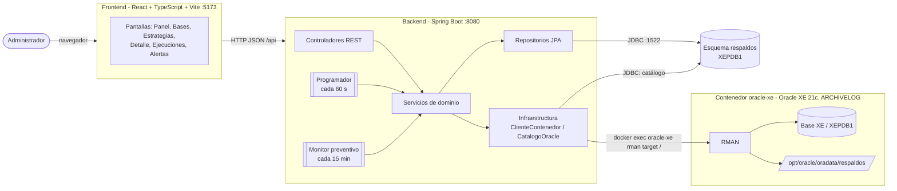
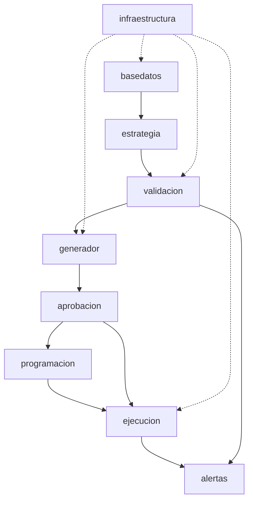
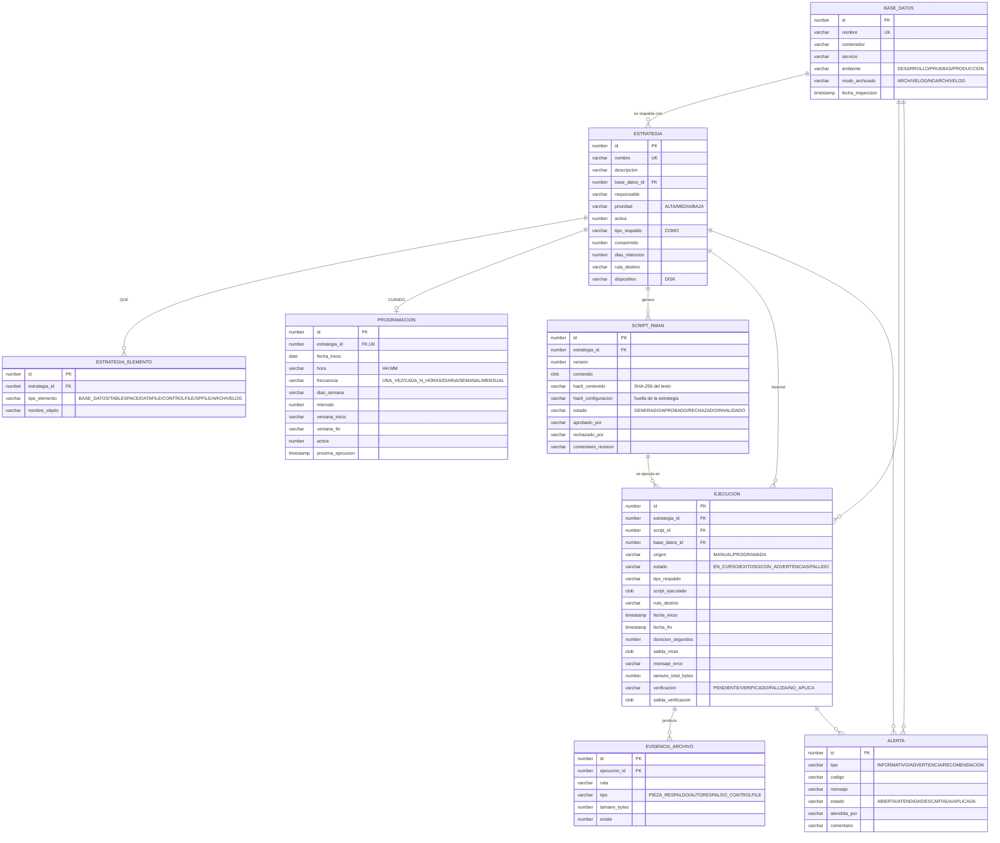
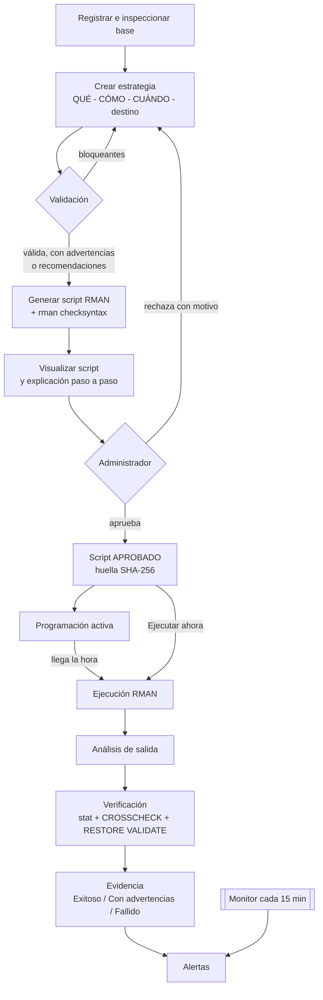
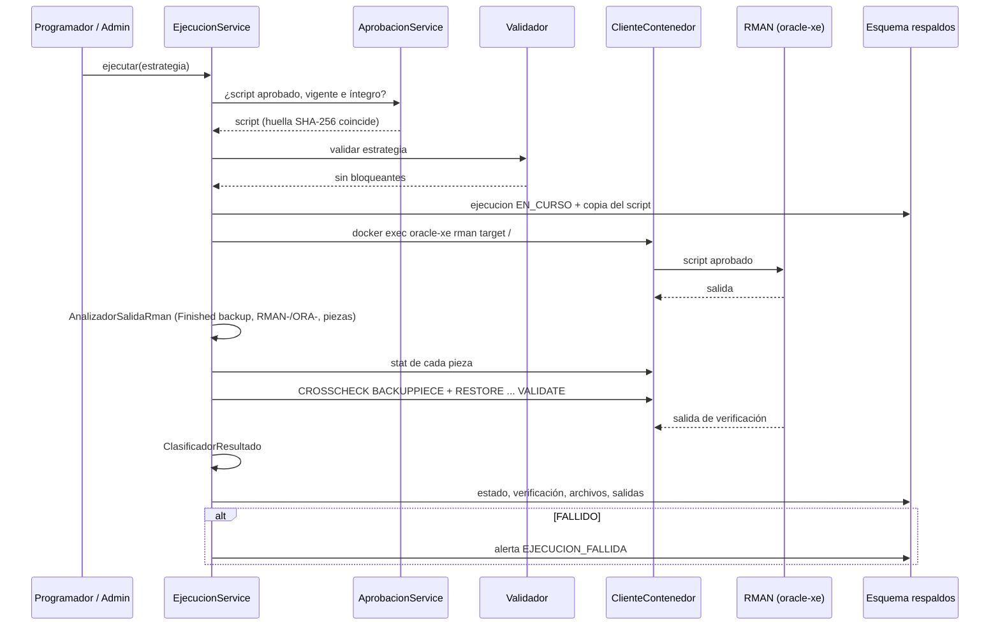
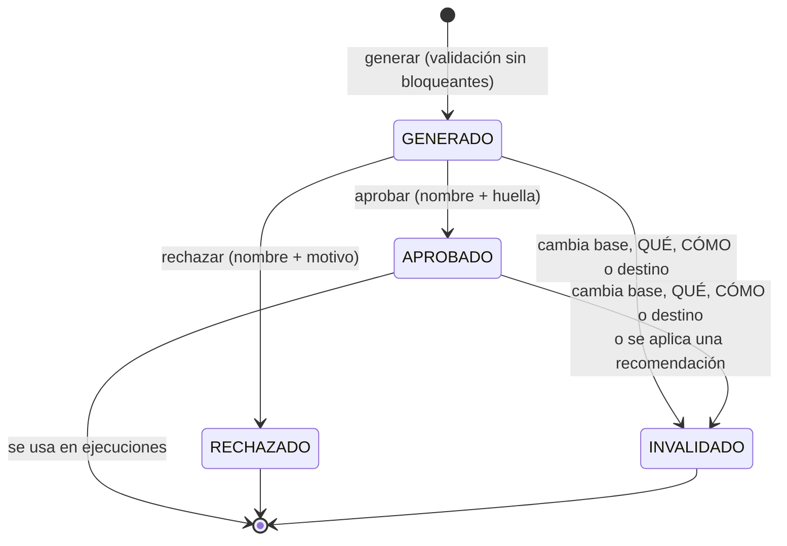
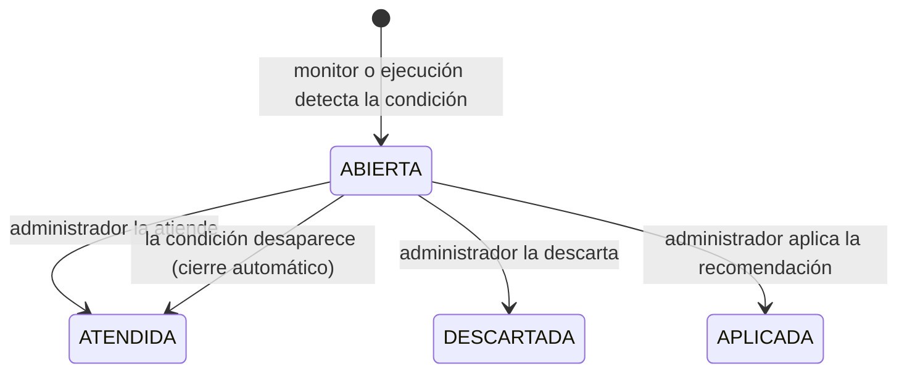

# Diseño de la aplicación

Herramienta para la gestión de estrategias de respaldo de bases de datos Oracle
EIF402 – Administración de Bases de Datos, II ciclo 2026

---

## 1. Arquitectura

La aplicación tiene tres capas y un ambiente Oracle de pruebas en Docker.



### Decisiones de arquitectura

| Decisión | Motivo |
|---|---|
| RMAN se ejecuta con `docker exec oracle-xe rman target /` | RMAN corre dentro del contenedor con autenticación del sistema operativo; la app no guarda contraseñas de SYS |
| Lista blanca de contenedores (`respaldos.docker.contenedores-permitidos=oracle-xe`) | Regla 1: nunca tocar la Oracle local del puerto 1521 |
| Los datos de la app viven en la misma XE (esquema `respaldos`) | Un solo ambiente de pruebas; JDBC por el puerto 1522 |
| Programador propio dentro de la app (no cron ni Oracle Scheduler) | Mantiene la relación estrategia → programación → script → ejecución en un solo lugar y permite validar justo antes de ejecutar |
| Esquema versionado con Flyway; Hibernate solo valida | Cambios repetibles y revisables |
| Frontend separado que habla con la API REST | La lógica de control vive en el backend; la interfaz no puede saltarse validación ni aprobación |

## 2. Módulos

La aplicación se construyó en 11 módulos, uno por commit.

| # | Módulo | Paquete | Responsabilidad |
|---|---|---|---|
| 0 | Base del proyecto y modelo de datos | `modelo`, `repositorio`, `db/migration` | Entidades, enumeraciones y esquema |
| 1 | Conexión con el ambiente | `infraestructura` | Ejecutar comandos en el contenedor permitido, leer el catálogo Oracle, medir espacio (`df`) |
| 2 | Bases de datos | `basedatos` | Registrar bases e inspeccionarlas (modo de archivado, tablespaces, datafiles) |
| 3 | Estrategias | `estrategia` | QUÉ, CÓMO, CUÁNDO y destino; activar/desactivar |
| 4 | Validador | `validacion` | Reglas que revisan la estrategia contra la base real |
| 5 | Generador de scripts | `generador` | Traduce la estrategia a RMAN, explica cada paso y revisa la sintaxis |
| 6 | Aprobación | `aprobacion` | Aprobar/rechazar; invalidar scripts cuando la estrategia cambia |
| 7 | Programación | `programacion` | Calcular próximas ejecuciones y dispararlas |
| 8 | Ejecución y evidencia | `ejecucion` | Ejecutar RMAN, analizar la salida, verificar y clasificar el resultado |
| 9 | Alertas | `alertas` | Monitor preventivo y gestión de alertas y recomendaciones |
| 10 | Frontend | `frontend/` | Interfaz web |

### Relación entre módulos



### Clases principales

| Clase | Qué hace |
|---|---|
| `ClienteContenedor` | Ejecuta `docker exec` solo en contenedores permitidos; corre RMAN, `rman checksyntax`, `df` y `stat` |
| `CatalogoOracle` | Lee modo de archivado, estado, tablespaces y datafiles por JDBC |
| `ReglasValidacion` / `ValidadorEstrategia` | Evalúan la estrategia y devuelven hallazgos clasificados |
| `GeneradorScriptRman` | Construye el script y la explicación paso a paso |
| `HuellaConfiguracion` | Huella de base + QUÉ + CÓMO + destino; si cambia, el script queda invalidado |
| `AprobacionService` | Aprueba con la huella SHA-256 del texto mostrado; decide si hay script ejecutable |
| `CalculadoraEjecuciones` / `ProgramadorRespaldos` | Calculan y disparan las ejecuciones programadas |
| `EjecucionService` | Orquesta ejecución → análisis → verificación → evidencia |
| `AnalizadorSalidaRman` | Lee la salida: "Finished backup", líneas `RMAN-`/`ORA-`, piezas generadas, archivos saltados |
| `VerificadorRespaldo` | Arma el script de verificación (`CROSSCHECK BACKUPPIECE` + `RESTORE ... VALIDATE`) |
| `ClasificadorResultado` | Decide Exitoso / Con advertencias / Fallido |
| `MonitorPreventivo` | Revisa condiciones de riesgo, abre y cierra alertas |
| `AlertaService` | Atender, descartar, aplicar recomendaciones |

## 3. Modelo de datos



### Notas del modelo

- **QUÉ** está en `estrategia_elemento`, **CÓMO** y destino en `estrategia`, **CUÁNDO** en
  `programacion` (una por estrategia). Un esquema "nivel 0 semanal + nivel 1 diario" son
  dos estrategias.
- La **ejecución guarda copias** (tipo, script, destino) para que el historial no cambie si
  después se modifica la estrategia.
- Restricciones `CHECK` en la base refuerzan las reglas: un script `APROBADO` debe tener
  quién y cuándo; uno `RECHAZADO`, quién, cuándo y motivo; solo una `RECOMENDACION` puede
  quedar `APLICADA`; `nombre_objeto` solo para TABLESPACE y DATAFILE.

## 4. Diagramas de comportamiento

### 4.1 Flujo completo (estrategia → alertas)



### 4.2 Ejecución y verificación



### 4.3 Estados de un script



### 4.4 Ciclo de una alerta



## 5. Generador de scripts: cómo se transforma la estrategia en RMAN

Esta es la pieza central que pide documentar la asignación (sección 8).

### 5.1 Reglas de traducción

1. **Todo va dentro de `RUN { }`.** Los comandos corren en orden; si uno falla, RMAN no
   ejecuta los siguientes.
2. **Un `BACKUP` por grupo del QUÉ**, en este orden:
   1. datafiles (base completa, o tablespaces y datafiles);
   2. archived redo logs;
   3. control file (después de los datos, para que registre los respaldos recién hechos);
   4. SPFILE.
3. **El CÓMO solo se aplica a los datafiles.** Archived logs, control file y SPFILE siempre
   se respaldan completos.

   | Tipo en la estrategia | Texto RMAN | Sufijo del TAG |
   |---|---|---|
   | Completo | *(nada)* | `FULL` |
   | Incremental nivel 0 | `INCREMENTAL LEVEL 0` | `N0` |
   | Nivel 1 diferencial | `INCREMENTAL LEVEL 1` | `N1D` |
   | Nivel 1 acumulativo | `INCREMENTAL LEVEL 1 CUMULATIVE` | `N1A` |

4. **Compresión** → `AS COMPRESSED BACKUPSET` en todos los comandos.
5. **Destino** → `FORMAT '<ruta>/%d_EST<id>_%T_%U'` (`%d` nombre de la base, `%T` fecha,
   `%U` identificador único que RMAN garantiza).
6. **TAG** `EST<id>_<parte>` identifica estrategia y parte (`N0`, `ARC`, `CTL`, `SPF`...).
7. **QUÉ → objeto RMAN**:

   | Elemento | Objeto RMAN |
   |---|---|
   | Base de datos | `DATABASE` |
   | Tablespace `USERS` | `TABLESPACE XEPDB1:USERS` (RMAN se conecta a la raíz del CDB) |
   | Datafile 12 o ruta | `DATAFILE 12` o `DATAFILE '/ruta'` |
   | Archived redo logs | `ARCHIVELOG ALL` |
   | Control file | `CURRENT CONTROLFILE` |
   | SPFILE | `SPFILE` |

8. **Defensas**: la ruta, los nombres de tablespace y los datafiles se revisan con
   expresiones regulares antes de entrar al script; el texto libre de los comentarios no
   puede abrir líneas nuevas. El generador **no** produce comandos que borren respaldos
   (`DELETE`) ni que cambien la base. La retención se guarda, pero no se traduce a
   `DELETE OBSOLETE` porque ese comando afecta todos los respaldos de la base.
9. El orden de los elementos es estable: la misma configuración produce siempre el mismo
   script.
10. Después de generarlo, se pasa por `rman checksyntax` dentro del contenedor.

### 5.2 Ejemplo real (estrategia 191 "XE nivel 0 completo")

Configuración: QUÉ = base + control file + SPFILE + archived logs; CÓMO = incremental
nivel 0 comprimido; destino `/opt/oracle/oradata/respaldos`.

```
# Estrategia: XE nivel 0 completo (id 191), script version 1
# Base: XE contenedor de pruebas (contenedor oracle-xe, servicio XEPDB1)
# Generado: 2026-09-30 22:47. Revise el script antes de aprobarlo.
RUN {
  # QUE: base de datos completa | COMO: incremental nivel 0, comprimido
  BACKUP AS COMPRESSED BACKUPSET INCREMENTAL LEVEL 0 TAG 'EST191_N0' FORMAT '/opt/oracle/oradata/respaldos/%d_EST191_%T_%U' DATABASE;
  # QUE: archived redo logs | COMO: completo, comprimido
  BACKUP AS COMPRESSED BACKUPSET TAG 'EST191_ARC' FORMAT '/opt/oracle/oradata/respaldos/%d_EST191_%T_%U' ARCHIVELOG ALL;
  # QUE: control file | COMO: completo, comprimido
  BACKUP AS COMPRESSED BACKUPSET TAG 'EST191_CTL' FORMAT '/opt/oracle/oradata/respaldos/%d_EST191_%T_%U' CURRENT CONTROLFILE;
  # QUE: SPFILE | COMO: completo, comprimido
  BACKUP AS COMPRESSED BACKUPSET TAG 'EST191_SPF' FORMAT '/opt/oracle/oradata/respaldos/%d_EST191_%T_%U' SPFILE;
}
```

Junto con el script, la pantalla muestra la **traducción paso a paso**: cada línea con la
decisión de la estrategia que la originó y una explicación en lenguaje claro.

### 5.3 Verificación posterior (regla 6)

Tras el respaldo, `VerificadorRespaldo` arma un segundo script, de solo lectura:

```
CROSSCHECK BACKUPPIECE '<pieza 1>', '<pieza 2>', ...;
RESTORE DATABASE VALIDATE;          -- o RESTORE TABLESPACE/DATAFILE ... VALIDATE
```

Además se ejecuta `stat` sobre cada pieza para confirmar que el archivo existe y medir su
tamaño. Usa las piezas exactas de esa ejecución (no el TAG) para no mezclar respaldos
anteriores.

### 5.4 Clasificación del resultado

| Resultado | Cuándo |
|---|---|
| **Fallido** | Tiempo agotado; líneas `RMAN-`/`ORA-`; código de salida ≠ 0; sin "Finished backup"; sin piezas; archivo inexistente; pieza EXPIRED; `RESTORE VALIDATE` con errores |
| **Con advertencias** | RMAN saltó archivos que no cambiaron ("skipping datafile..."), o no se pudo completar la verificación por un problema del ambiente |
| **Exitoso** | Terminó, todas las piezas existen y la verificación pasó |

## 6. Diseño de interfaz

Aplicación de una sola página con menú superior y un campo **Administrador** (nombre que
se usa al aprobar y atender alertas).

```
┌───────────────────────────────────────────────────────────────────────────┐
│ Gestión de estrategias de respaldo Oracle                                 │
│ [Panel] [Bases de datos] [Estrategias] [Ejecuciones] [Alertas]  Admin:[__]│
├───────────────────────────────────────────────────────────────────────────┤
│                         contenido de la pantalla                          │
└───────────────────────────────────────────────────────────────────────────┘
```

| Pantalla | Contenido | Acciones |
|---|---|---|
| **Panel** | Alertas abiertas por tipo, estado de cada programación (próxima ejecución), últimas ejecuciones | Ir al detalle |
| **Bases de datos** | Lista de bases; resultado de la inspección (modo de archivado, tablespaces, datafiles, mensajes) | Registrar, modificar, eliminar, inspeccionar |
| **Estrategias** | Lista con base, prioridad, tipo, estado | Nueva, abrir detalle |
| **Formulario de estrategia** | Cinco secciones: Información general · Qué respaldar · Cómo respaldar · Cuándo respaldar · Destino | Guardar |
| **Detalle de estrategia** | Resumen QUÉ/CÓMO/CUÁNDO/destino y una barra de pasos con el flujo | 1 Validar · 2 Generar script · 3 Aprobar/Rechazar · 4 Programación · 5 Ejecutar ahora; activar/desactivar |
| **Ejecuciones** | Historial: fecha, estrategia, tipo, inicio, fin, duración, resultado, verificación | Abrir evidencia |
| **Detalle de ejecución** | Archivos generados (ruta, tamaño, existe), script ejecutado, salida de RMAN, salida de verificación, mensaje de error | — |
| **Alertas** | Filtros por estado y tipo; mensaje, origen, fecha | Atender, descartar, aplicar recomendación, lanzar la revisión preventiva ("Revisar ahora") |

### Formulario de estrategia

```
Información general  Nombre [______]  Base [XE ▾]  Responsable [____]
                     Prioridad [ALTA ▾] (muestra el criterio y las horas máximas sin respaldo)
                     Descripción [_____________________________]
Qué respaldar        [x] Base de datos [ ] Control file [ ] SPFILE [ ] Archived redo logs
                     Tablespaces [USERS, ...]   Datafiles [12, ...]
Cómo respaldar       Tipo [Incremental nivel 0 ▾]  [x] Comprimido  Retención [7] días
                     (descripción del tipo elegido)
Cuándo respaldar     [x] Programar ejecución automática   Inicio [2026-10-05]  Hora [23:00]
                     Frecuencia [SEMANAL ▾]  Intervalo [1]  Días [x]LUN [ ]MAR ...
                     Ventana [22:00] a [05:00]
Destino              Ruta [/opt/oracle/oradata/respaldos]  Dispositivo DISK
                     (el espacio disponible se revisa al validar)
                                                                    [Guardar]
```

### Convenciones visuales

- Cada mensaje lleva una etiqueta de color según su tipo: **Bloqueante**, **Advertencia**,
  **Recomendación**, **Informativo**, para que nunca se confundan.
- Los estados de ejecución (Exitoso / Con advertencias / Fallido) y de verificación usan
  etiquetas de color.
- El botón **Ejecutar ahora** está deshabilitado si no hay un script aprobado.
- Aprobar y rechazar exigen el nombre del administrador; rechazar exige un motivo.

## 7. Flujo de construcción de estrategias

1. **Registrar la base** (contenedor `oracle-xe`, servicio `XEPDB1`, ambiente PRUEBAS) e
   **inspeccionarla**: la app lee el modo de archivado y lista tablespaces y datafiles, de
   donde el usuario elige el QUÉ.
2. **Información general**: nombre, descripción, base, responsable y prioridad. El estado (activa/inactiva) se cambia con **Activar / Desactivar** en el detalle; una estrategia nueva queda inactiva.
3. **QUÉ**: base completa o tablespaces/datafiles, más control file, SPFILE y archived logs.
4. **CÓMO**: tipo de respaldo, compresión, retención.
5. **CUÁNDO**: fecha de inicio, hora, frecuencia, días, intervalo y ventana.
6. **Destino**: ruta dentro del contenedor y dispositivo.
7. **Validar**: la app revisa todo contra la base real. Si hay **bloqueantes** se vuelve al
   formulario; las advertencias y recomendaciones se muestran pero no impiden seguir.
8. **Generar** el script, revisar su sintaxis y **mostrarlo** con la explicación.
9. **Aprobar** (o rechazar con motivo). Cualquier cambio posterior en base, QUÉ, CÓMO o
   destino invalida la aprobación.
10. **Activar** la estrategia y su programación. El programador ejecuta cuando corresponde;
    también se puede **ejecutar ahora**.
11. Revisar la **evidencia** y atender las **alertas**.

Reglas que impone el flujo:

| Paso | No se puede avanzar si... |
|---|---|
| Generar | La validación tiene bloqueantes |
| Aprobar | El script ya no es vigente (la estrategia cambió) |
| Ejecutar | No hay script aprobado, vigente e íntegro, o la validación del momento tiene bloqueantes |
| Ejecución programada | Se pasó más de 30 min de la hora (se registra como omitida) |

## 8. API REST (resumen)

| Método y ruta | Uso |
|---|---|
| `GET/POST /api/bases-datos`, `PUT/DELETE /api/bases-datos/{id}` | CRUD de bases |
| `POST /api/bases-datos/{id}/inspeccion` | Inspeccionar la base |
| `GET/POST /api/estrategias`, `PUT/DELETE /api/estrategias/{id}` | CRUD de estrategias (incluye programación) |
| `POST /api/estrategias/{id}/activar` · `/desactivar` | Estado |
| `GET /api/opciones` | Listas de valores y descripciones para el formulario |
| `POST /api/estrategias/{id}/validacion` | Validar |
| `POST /api/estrategias/{id}/scripts` · `GET` | Generar y listar scripts |
| `POST /api/scripts/{id}/aprobacion` · `/rechazo` | Revisión del administrador |
| `GET /api/programacion`, `GET /api/estrategias/{id}/programacion/proximas` | Estado y próximas ejecuciones |
| `POST /api/estrategias/{id}/programacion/activar` · `/desactivar` | Programación |
| `POST /api/estrategias/{id}/ejecuciones` | Ejecutar ahora |
| `GET /api/ejecuciones`, `GET /api/ejecuciones/{id}` | Historial y evidencia |
| `GET /api/alertas`, `GET /api/alertas/resumen` | Alertas |
| `POST /api/alertas/{id}/atender` · `/descartar` · `/aplicar` | Gestión de alertas |
| `POST /api/alertas/revision` | Lanzar la revisión preventiva |
